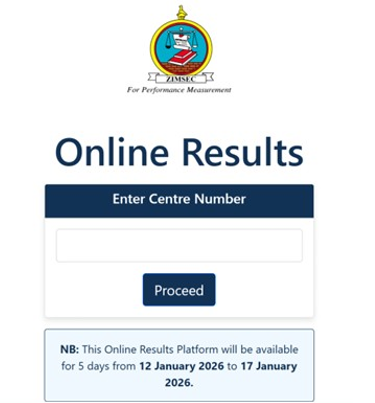
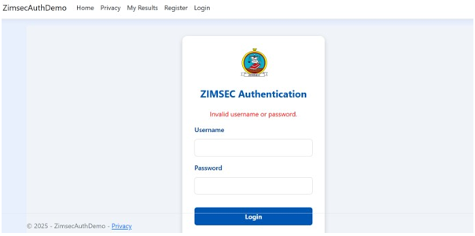

# Results-Portal-website
Website where students can login and view their results online

# smart-health-monitoring-system
IoT-based wearable health monitoring and fall detection system using ESP8266

## 📸 Project Images

### Land On Page

### Register Page

### Login Page

### Authantication Page

### Results Page

## 🎥 Project Demo

Watch the full system demonstration on LinkedIn:

🔗 [https://www.linkedin.com/posts/tadiwanashe-shamba-a1b165274_embeddedsystems-arduino-iot-ugcPost-7430145914108841984-3cvY](https://www.linkedin.com/posts/tadiwanashe-shamba-a1b165274_cybersecurity-websecurity-aspnet-activity-7430503567519604736-EnLS?utm_medium=ios_app&rcm=ACoAAELxWXcBeloRRHznhrRXR-DGuk3qAOwVIVA&utm_source=social_share_send&utm_campaign=copy_link)
